https://github.com/swoller22/MozaicMaker/

# MozaicMaker

This full-stack project was developed by Stephen Woller for BU MET 602: Server-side Development and BU MET 664: Artificial Intelligence in the Fall 2021 Semester.

## Project Description

The purpose of this project was to create a website that allows users to input a large image and a set of images, such that the set of images is used
to recreate a mozaic of the large image. An example is shown below.

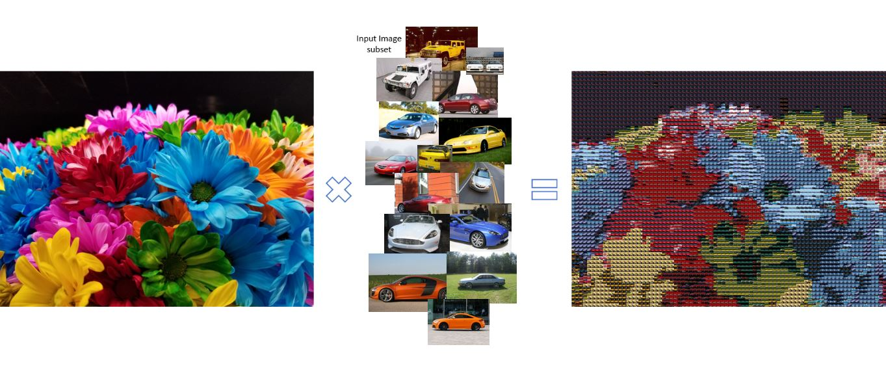

There are three mozaic creation algorithms currently implemented: Brute Force Search, Hill Climbing over an RGB-Sorted Colorspace, and Hill Climbing over an HSV-Sorted Colorspace. Each of these algorithms involve the following steps:
 1. Breaking the large image down into blocks based on the small image size
 2. Search through the input image set for the best match to each block, defined as having the minimum color distance to that block
 3. Create the large image mozaic by joining resized variants of the best matches

The point of variation across the 3 algorithms is step 2, searching for the best match for each block.

### Brute Force Search

The Brute Force Search algorithm searches the entire input image set to find the minimum color distance. While this will always find the optimal solution, the time complexity is prohibitive as the number of blocks and input image set size increases. The algorithm runs in *O*(*r*_c_*n*) time where *r* is the number of rows of blocks, *c* is the number of columns of blocks, and *n* is the input image set size.

To address the time complexity concerns, 2 new algorithms were investigated and generated: Hill Climbing over an RGB-Sorted Colorspace and Hill Climbing over an HSV-Sorted Colorspace. These algorithms both run in *O*(*r*_c_) time, due to restrictions on the search space as will be soon covered.

### Hill Climbing over an RGB-Sorted Colorspace

The Hill Climbing over an RGB-Sorted Colorspace Search Algorithm is a variant of the hill climbing algorithm as defined in Artificial Intelligence: A Modern Approach 4th Edition by Stuart Russell and Peter Norvig. The optimization problem being solved is minimization of color distance. A state-space landscape is generated by computing the average RGB of each input image and sorting this set of averages by R then G then B. The "elevation" of each point on the landscape is the color-distance to the large image block being matched against. An example state-space landscape with this sorting approach is shown in the following two images:

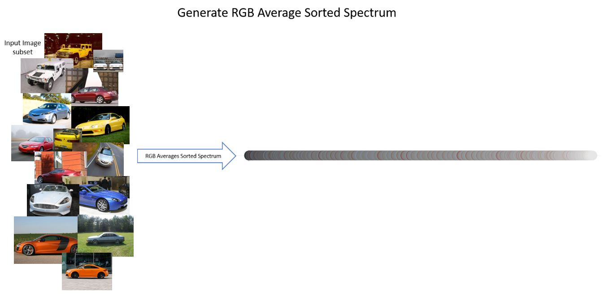

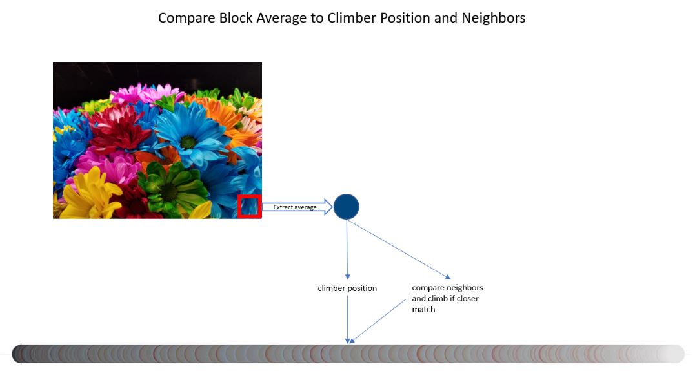

However, using this approach yields a landscape with many ridges. This should be clear based on the above image, the transition from neighbor to neighbor is not smooth and it's hard to see any pattern at all. Thus, the hill climber often gets trapped at local minimums and does not find any reasonable match.

To increase the state-space landscape and probability for a meaningful and reasonable match, this algorithm was extended to not only sort on R then G then B but all 6 combinations of the components (RGB, RBG, GRB, GBR, BRG, BGR). A climber is positioned at the center of each landscape and attempts to climb to a best match. These 6 climbers results are then compared to find the absolute best match found and that result is used. The resulting mozaics of this enhancement were better than the single landscape and climber approach. This improvement was likely due to this algorithms ability to search 6 spaces so even though each space is non-optimal for climbing it was less likely to be placed in a ridge, or in the worst (and most probable) case has a minimum of 6 bad positions to select from.

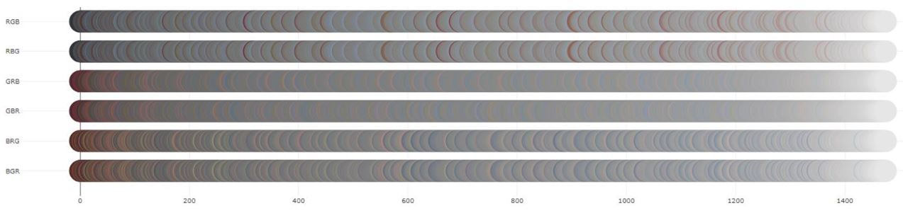

An example mozaic generated using this technique is shown here:

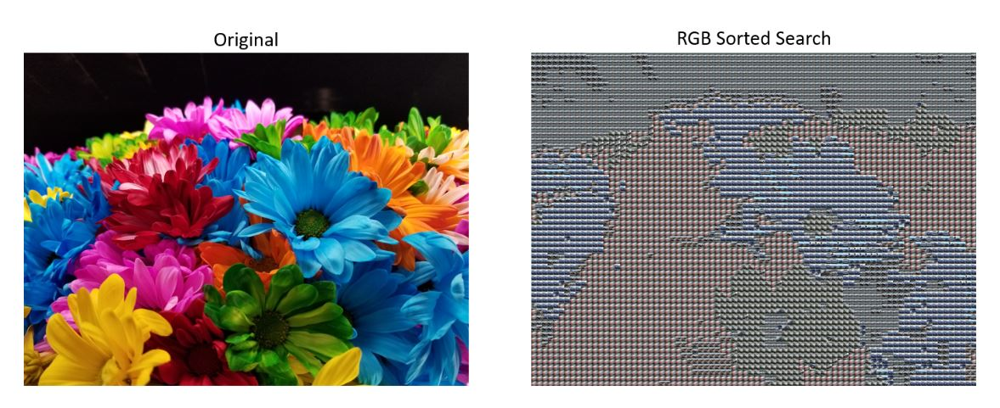

To address the landscape ridge issues, other sorting alternatives were investigated. [This article](https://www.alanzucconi.com/2015/09/30/colour-sorting/) outlines the issues of sorting colors, and proposed various alternatives to the naive RGB-sort approach.

### Hill Climbing over an HSV-Sorted Colorspace

Before delving into the Hill Climbing over an HSV-Sorted Colorspace algorithm, the justification for investigating this approach should be made apparent. From the [article](https://www.alanzucconi.com/2015/09/30/colour-sorting/) mentioned prior, the author laid out results of various sorting techniques. To give a short synopsis of the articles results, we begin with the following unsorted color spectrum:

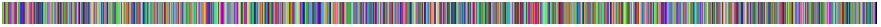

Sorting on RGB gives the following results:

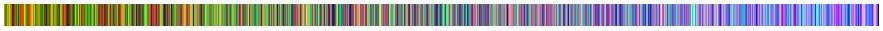

The authors results validate our own, that RGB sorting yields very poor results. The author then reviews the Hue, Saturation, Value space which is comprised of a more telling component of a color: Hue. Sorting on Hue first, Saturation second, and Value third yields the following results:

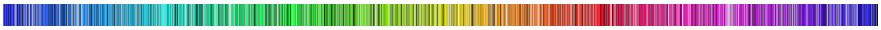

This result was promising enough to explore in our project. Sorting on our example input image data yields very strong results, and appeared to both lessen ridges and better distribute the colors in our landscape: 

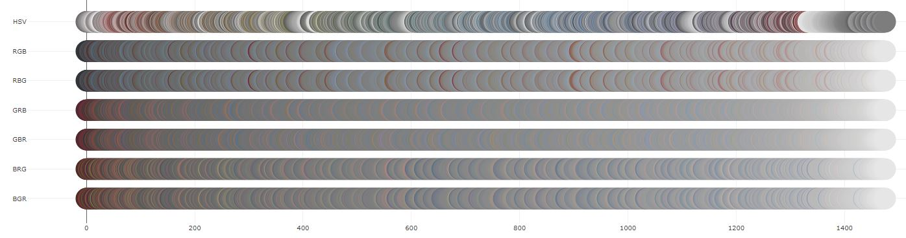

A key feature of this algorithm leverages the visually-appealing distribution of this new spectrum. Users are able to enter the number of climbers whom are automatically distributed evenly throughout the landscape.

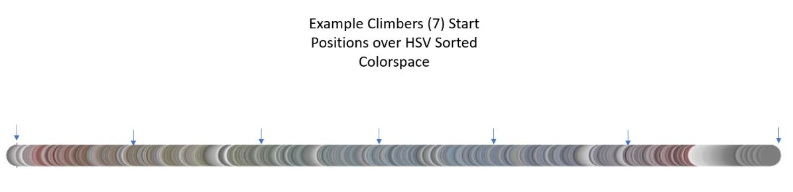

With multiple starting positions, even with ridges, a reasonable image match is likely to be found. Analyzing the input image set HSV sorted colorspace prior to mozaic generation using this algorithm to select an appropriate climber count will typically yield the best results. A note on this subject is that the computation time will scale linearly with the number of climbers selected, thus selecting too many climbers will leave us in the same time-prohibitive state that the Brute Force Algorithm left us in. 

Results from this technique are shown below:

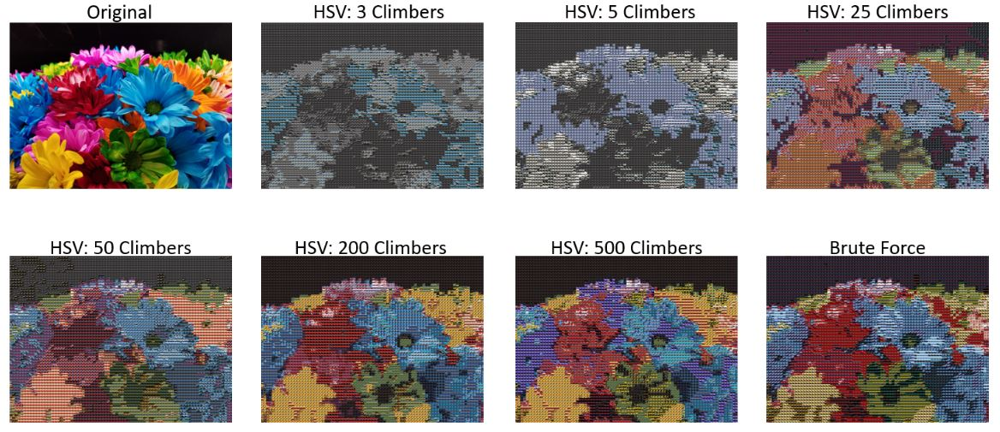

At around 25 climbers, we are able to generate reasonable results on ~3000 input images in a reasonable amount of time. Depending on the users own opinion, this may be an acceptable solution. Personally, for this example set, 200 climbers appears to be the optimal solution for speed and performance, where 500 climbers became time-prohibitive for a real world application.

## Limitations and Future Considerations

##### Limitation 1: Time

Due to this being a single semester project, the scope needed to be limited to ensure all project requirements were met while implementing an acceptable amount of completed features. From a project management perspective, this was the most prohibitive limitation.

###### Future Considerations

If given more time for this project, I would add more features and host the application on Heroku.

##### Limitation 2: Repetition in Mozaic

Repetition in the final mozaic severely limits the appeal of the result. While repetition technically conforms to the optimal solution of minimum color distance, it is less visually appealing than if there were more variety.

###### Future Considerations

To resolve repetition in the final mozaic, there are multiple approaches that could be used: random selection from a color-distance heuristic solution set, random start positions for hill climbing, simulated annealing, local beam search, and stochastic beam search. The common factor in all of these approaches is leveraging stochasticism to expand the number of input images used in the final result. Further, these all have the benefit of producing different results for each run, allowing the user to select from multiple solutions with the same input.

##### Limitation 3: Time Complexity

Generally speaking, producing reasonable results is time-prohibitive. In a real-world application, this would be unacceptable.

###### Future Considerations

The server-side algorithms should be reviewed and optimized. Perhaps a grouping technique in colorspace could be used to limit searches further by avoiding discernably unoptimal input images.

##### Limitation 4: Image Preprocessing

Image resizing creates unrecognizable results in some cases - particularly when the original image has a lot of detail and the scale down is too significant or when the shape of the original image is distant from a square.

###### Future Considerations

Image preprocessing could be optimized or identify issues with the input image set or large image prior to attempting to generate a mozaic.

## How To Run

Due to the application not being fully hosted on the cloud, additional setup is required to run. The steps include: Set up AWS S3 bucket and MongoDB Atlas access, starting the node server, and running the client on localhost

#### Step 0: Initial Download

Download zip of this Github Directory and unzip into desired directory.

#### Step 1: Set up AWS S3 bucket and MongoDB Atlas access

If available from the author, copy and paste the .env file which was submitted with this assignment into the MozaicMaker/server/ folder

#### Step 2: Starting the node server

2. Navigate to the /MozaicMaker/server/ folder
1. Run `npm install` to generate /node_modules/ dependencies
2. Run 'node app.js'
3. The server is now running on Port 5000

#### Step 3: Running the client on localhost

1. Configure a Web Server to point to /MoziacMaker/client/
2. Launch Web Server in Google Chrome (website untested on other platforms)
3. The MozaicMaker Log In page should be displayed

## Design

A Client-Server Architecture was used to adhere to the Separation of Concerns design principle which is critical in applications that entail of complex user interfaces and backend computation. A high-level view of the architectural design is shown below:

### Server-Side Design

The server design is set up as follows:

### Technology stack

The following technologies/libraries were used for this project:

| Technology/Library  | Version | Use Description |
| ------------- | ------------- | ------------ |
| Bootstrap  | 5.1.3  | Front-end design |
| JQuery  | 1.12.3  | Front-end DOM traversal and manipulation |
| Plotly  | 2.6.3  | Front-end plotting |
| Lightbox  | 2.8.2  | Front-end image gallery view |
| Axios  | N/A | HTTP client |
| Express  | 4.17.1 | Back-end web application framework |
| Mongoose  | 6.0.12 | Back-end mongodb library |
| Passport  | 0.5.0 | Back-end authentication middleware library |
| Multer  | 1.4.3 | Back-end multipart/form-data handling middleware library |
| AWS-SDK | 2.1013.0 | Back-end AWS interface library |
| Sharp | 0.29.2 | Back-end Node.js image processing library |

For a full list of libraries used, see server/package.json and client imports.

