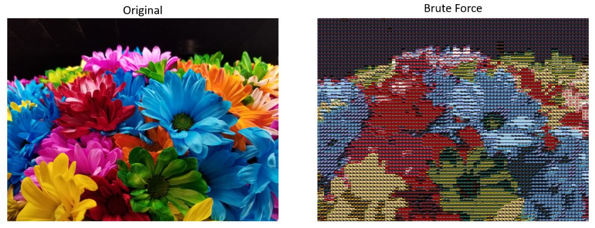

# MozaicMaker

This full-stack project was developed by Stephen Woller for BU MET 602: Server-side Development and BU MET 664: Artificial Intelligence in the Fall 2021 Semester.

## Project Description

The purpose of this project was to create a website that allows users to input a large image and a set of images, such that the set of images is used
to recreate a mozaic of the large image. An example is shown below.

There are three mozaic creation algorithms currently implemented: Brute Force Search, Hill Climbing over an RGB-Sorted Colorspace, and Hill Climbing over an HSV-Sorted Colorspace. Each of these algorithms involve the following steps:
 1. Breaking the large image down into blocks based on the small image size
 2. Search through the input image set for the best match to each block, defined as having the minimum color distance to that block
 3. Create the large image mozaic by joining resized variants of the best matches

The point of variation across the 3 algorithms is step 2, searching for the best match for each block.

### Brute Force Search

The Brute Force Search algorithm searches the entire input image set to find the minimum color distance. While this will always find the optimal solution, the time complexity is prohibitive as the number of blocks and input image set size increases. The algorithm runs in *O*(*r*_c_*n*) time where *r* is the number of rows of blocks, *c* is the number of columns of blocks, and *n* is the input image set size.

To address the time complexity concerns, 2 new algorithms were investigated and generated: Hill Climbing over an RGB-Sorted Colorspace and Hill Climbing over an HSV-Sorted Colorspace. These algorithms both run in *O*(*r*_c_) time, due to restrictions on the search space as will be soon covered.

### Hill Climbing over an RGB-Sorted Colorspace

The Hill Climbing over an RGB-Sorted Colorspace Search Algorithm is a variant of the hill climbing algorithm as defined in Artificial Intelligence: A Modern Approach 4th Edition by Stuart Russell and Peter Norvig. The optimization problem being solved is minimization of color distance. A state-space landscape is generated by computing the average RGB of each input image and sorting this set of averages by R then G then B. The "elevation" of each point on the landscape is the color-distance to the large image block being matched against. An example state-space landscape with this sorting approach is shown in the following two images:

However, using this approach yields a landscape with many ridges. This should be clear based on the above image, the transition from neighbor to neighbor is not smooth and it's hard to see any pattern at all. Thus, the hill climber often gets trapped at local minimums and does not find any reasonable match.

To increase the state-space landscape and probability for a meaningful and reasonable match, this algorithm was extended to not only sort on R then G then B but all 6 combinations of the components (RGB, RBG, GRB, GBR, BRG, BGR). A climber is positioned at the center of each landscape and attempts to climb to a best match. These 6 climbers results are then compared to find the absolute best match found and that result is used. The resulting mozaics of this enhancement were better than the single landscape and climber approach. This improvement was likely due to this algorithms ability to search 6 spaces so even though each space is non-optimal for climbing it was less likely to be placed in a ridge, or in the worst (and most probable) case has a minimum of 6 bad positions to select from.

An example mozaic generated using this technique is shown here:

To address the landscape ridge issues, other sorting alternatives were investigated. [This article](https://www.alanzucconi.com/2015/09/30/colour-sorting/) outlines the issues of sorting colors, and proposed various alternatives to the naive RGB-sort approach.

### Hill Climbing over an HSV-Sorted Colorspace

Before delving into the Hill Climbing over an HSV-Sorted Colorspace algorithm, the justification for investigating this approach should be made apparent. From the [article](https://www.alanzucconi.com/2015/09/30/colour-sorting/) mentioned prior, the author laid out results of various sorting techniques. To give a short synopsis of the articles results, we begin with the following unsorted color spectrum:

Sorting on RGB gives the following results:

The authors results validate our own, that RGB sorting yields very poor results. The author then reviews the Hue, Saturation, Value space which is comprised of a more telling component of a color: Hue. Sorting on Hue first, Saturation second, and Value third yields the following results:

This result was promising enough to explore in our project. Sorting on our example input image data yields very strong results, and appeared to both lessen ridges and better distribute the colors in our landscape: 

A key feature of this algorithm leverages the visually-appealing distribution of this new spectrum. Users are able to enter the number of climbers whom are automatically distributed evenly throughout the landscape.

With multiple starting positions, even with ridges, a reasonable image match is likely to be found. Analyzing the input image set HSV sorted colorspace prior to mozaic generation using this algorithm to select an appropriate climber count will typically yield the best results. A note on this subject is that the computation time will scale linearly with the number of climbers selected, thus selecting too many climbers will leave us in the same time-prohibitive state that the Brute Force Algorithm left us in. 

Results from this technique is shown below:

## How To Run

sfsdffg

## Design

### Technology stack

### Top-Level Design

### Client-Side Design

#### User Experience

### Server-Side Design

#### Database Design

### Security Considerations

## Limitations and Future Considerations
